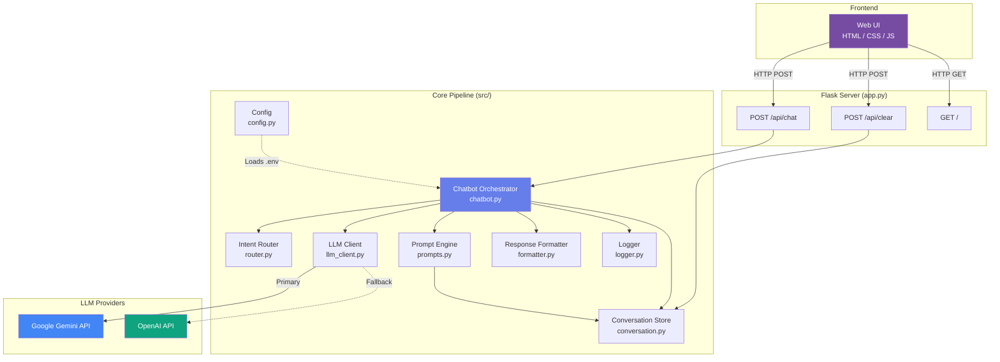
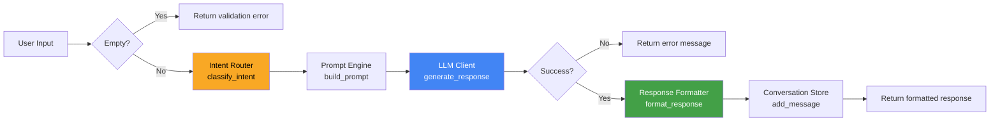
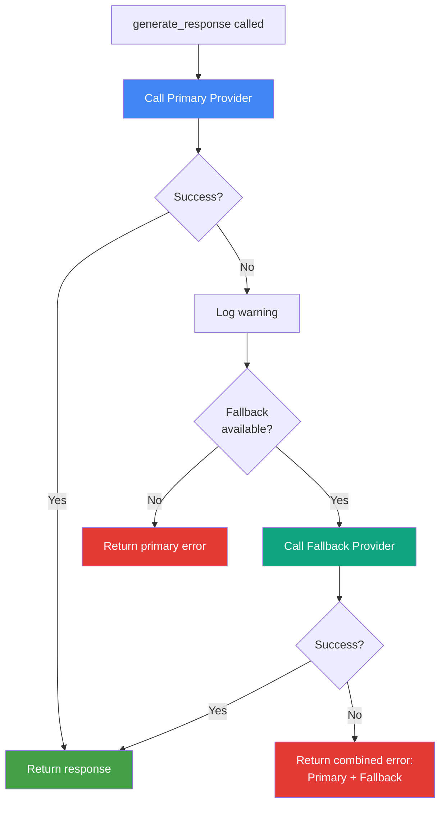
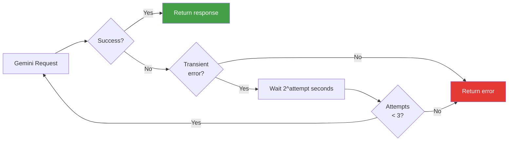
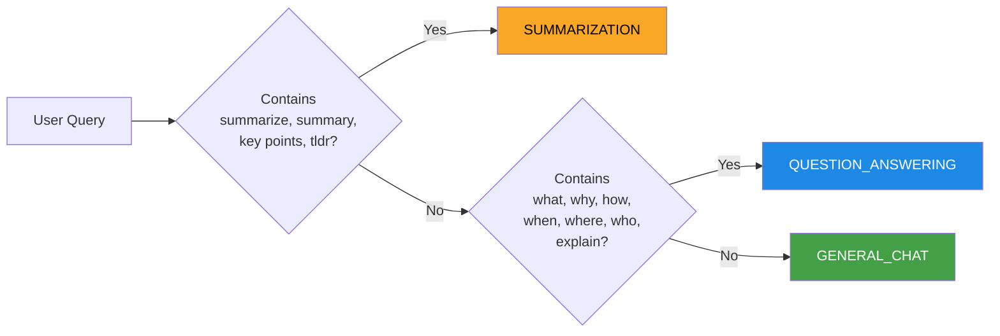
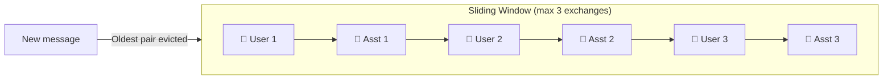

# 🤖 LLM Chatbot

An intelligent, multi-provider chatbot web application built with Python and Flask. It supports **Google Gemini** (primary) and **OpenAI** (fallback) with automatic failover, intent-based routing, conversation memory, and a polished web UI.

---

## Table of Contents

- [Introduction](#introduction)
- [Architecture Overview](#architecture-overview)
- [Query Processing Pipeline](#query-processing-pipeline)
- [Provider Fallback Flow](#provider-fallback-flow)
- [Project Structure](#project-structure)
- [Module Reference](#module-reference)
  - [Configuration](#1-configuration---srcconfigpy)
  - [Intent Router](#2-intent-router---srcrouterpy)
  - [Prompt Engine](#3-prompt-engine---srcpromptspy)
  - [LLM Client](#4-llm-client---srcllm_clientpy)
  - [Response Formatter](#5-response-formatter---srcformatterpy)
  - [Conversation Store](#6-conversation-store---srcconversationpy)
  - [Logger](#7-logger---srcloggerpy)
  - [Chatbot Orchestrator](#8-chatbot-orchestrator---srcchatbotpy)
  - [Flask App](#9-flask-app---apppy)
- [Frontend](#frontend)
- [API Endpoints](#api-endpoints)
- [Setup & Installation](#setup--installation)
- [Configuration Reference](#configuration-reference)
- [Retry & Error Handling](#retry--error-handling)

---

## Introduction

This chatbot application provides a conversational AI interface that:

- Classifies user queries into **Summarization**, **Question Answering**, or **General Chat** intents
- Constructs intent-specific system prompts with conversation context
- Calls LLM APIs with automatic provider fallback (Gemini → OpenAI)
- Formats responses based on detected intent
- Maintains a sliding-window conversation history (last 3 exchanges)
- Logs all queries, responses, and errors with timestamps

---

## Architecture Overview



---

## Query Processing Pipeline

Every user message flows through this pipeline inside [`Chatbot.process_query()`](src/chatbot.py):



**Step-by-step:**

| Step | Component | File | What it does |
|------|-----------|------|-------------|
| 1 | Input Validation | [`chatbot.py`](src/chatbot.py) | Rejects empty/whitespace-only queries |
| 2 | Intent Classification | [`router.py`](src/router.py) | Keyword matching → `SUMMARIZATION`, `QUESTION_ANSWERING`, or `GENERAL_CHAT` |
| 3 | Prompt Construction | [`prompts.py`](src/prompts.py) | Builds system prompt + conversation context + current query |
| 4 | LLM API Call | [`llm_client.py`](src/llm_client.py) | Calls primary provider, falls back on failure |
| 5 | Response Formatting | [`formatter.py`](src/formatter.py) | Intent-specific formatting (bullets, answer/details, etc.) |
| 6 | Conversation Storage | [`conversation.py`](src/conversation.py) | Stores exchange in sliding window (max 3 pairs) |
| 7 | Logging | [`logger.py`](src/logger.py) | Logs query, intent, response, token count, errors |

---

## Provider Fallback Flow

The [`LLMClient`](src/llm_client.py) implements automatic failover between providers:



The Gemini client also includes **built-in retry logic** for transient errors (503 / UNAVAILABLE):



---

## Project Structure

```
llmchatbot/
├── app.py                  # Flask web application & API routes
├── main.py                 # Alternative entry point with banner
├── requirements.txt        # Python dependencies
├── .env.example            # Environment variable template
├── src/
│   ├── __init__.py
│   ├── config.py           # Configuration management from .env
│   ├── chatbot.py          # Main orchestrator - ties everything together
│   ├── router.py           # Intent classification (keyword matching)
│   ├── prompts.py          # Prompt construction with context
│   ├── llm_client.py       # Multi-provider LLM client (Gemini + OpenAI)
│   ├── formatter.py        # Intent-specific response formatting
│   ├── conversation.py     # Data models & conversation history store
│   └── logger.py           # Structured logging (console + file)
├── templates/
│   └── index.html          # Chat UI template
├── static/
│   ├── css/style.css       # UI styling
│   └── js/app.js           # Frontend chat logic
└── interfaces/
    └── __init__.py          # Interfaces package placeholder
```

---

## Module Reference

### 1. Configuration - [`src/config.py`](src/config.py)

Loads and validates all settings from environment variables via `python-dotenv`.

**Key class:** `Config` (dataclass)

| Field | Type | Default | Source |
|-------|------|---------|--------|
| `provider` | str | `"gemini"` | `LLM_PROVIDER` |
| `gemini_api_key` | str | `""` | `GEMINI_API_KEY` |
| `openai_api_key` | str | `""` | `OPENAI_API_KEY` |
| `model` | str | auto | `LLM_MODEL` |
| `temperature` | float | `0.7` | `LLM_TEMPERATURE` |
| `timeout` | int | `30` | `LLM_TIMEOUT` |
| `log_level` | str | `"INFO"` | `LOG_LEVEL` |

**Validation rules:**
- Provider must be `"gemini"` or `"openai"`
- At least one API key must be set
- Temperature must be between 0.0 and 2.0
- Timeout must be positive

---

### 2. Intent Router - [`src/router.py`](src/router.py)

Classifies user queries using keyword matching.



| Intent | Keywords | System Prompt Behavior |
|--------|----------|----------------------|
| `SUMMARIZATION` | summarize, summary, key points, tldr | Extracts key points as bullet list |
| `QUESTION_ANSWERING` | what, why, how, when, where, who, explain | Direct answer + supporting details |
| `GENERAL_CHAT` | *(default)* | Friendly conversational assistant |

---

### 3. Prompt Engine - [`src/prompts.py`](src/prompts.py)

Builds structured prompts in OpenAI Chat Completion format:

```
[
  { "role": "system",    "content": "<intent-specific system prompt>" },
  { "role": "user",      "content": "<previous user message>" },
  { "role": "assistant", "content": "<previous assistant response>" },
  ...
  { "role": "user",      "content": "<current query>" }
]
```

The system prompt changes based on the classified intent. Conversation context from the last 3 exchanges is injected between the system prompt and the current query.

---

### 4. LLM Client - [`src/llm_client.py`](src/llm_client.py)

Three classes work together:

| Class | Provider | SDK | Features |
|-------|----------|-----|----------|
| `GeminiClient` | Google Gemini | `google-genai` | Retry on 503, system instruction support |
| `OpenAIClient` | OpenAI | `openai` | Standard chat completions, token counting |
| `LLMClient` | Unified | Both | Primary/fallback routing, graceful degradation |

**Message format conversion** (Gemini):
- `"system"` → `system_instruction` in config
- `"user"` → `role: "user"` content
- `"assistant"` → `role: "model"` content

**Graceful degradation:** If the `openai` package is not installed, the OpenAI fallback is silently skipped (no crash).

---

### 5. Response Formatter - [`src/formatter.py`](src/formatter.py)

Applies intent-specific formatting to raw LLM output:

| Intent | Formatting |
|--------|-----------|
| Summarization | Normalizes bullet points (`*/-/+` → `•`), adds spacing after headers |
| Question Answering | Splits into `**Answer:**` and `**Details:**` sections |
| General Chat | Normalizes whitespace, preserves paragraph structure |

All formatters share a `_normalize_whitespace()` method that cleans excessive newlines and spaces.

---

### 6. Conversation Store - [`src/conversation.py`](src/conversation.py)

**Data models:**
- `Intent` — Enum: `SUMMARIZATION`, `QUESTION_ANSWERING`, `GENERAL_CHAT`
- `Message` — Dataclass: `role`, `content`, `timestamp`
- `LLMResponse` — Dataclass: `success`, `content`, `error_message`, `token_count`

**`ConversationStore`** maintains a sliding window of the last 3 exchanges (6 messages). Uses FIFO eviction when the limit is exceeded.



---

### 7. Logger - [`src/logger.py`](src/logger.py)

Dual-output structured logging:

| Handler | Level | Output |
|---------|-------|--------|
| Console | DEBUG+ | `stdout` |
| File | INFO+ | `logs/chatbot.log` |

**Log format:** `[timestamp] LEVEL - llm_chatbot - message`

**Logged events:**
- `log_query()` — Query text, classified intent, timestamp
- `log_response()` — Response preview (100 chars), token count, timestamp
- `log_error()` — Exception type, message, full stack trace

---

### 8. Chatbot Orchestrator - [`src/chatbot.py`](src/chatbot.py)

The `Chatbot` class wires all components together. On initialization it creates:
- `ConversationStore` (max 3 exchanges)
- `IntentRouter`
- `PromptEngine` (with conversation store reference)
- `LLMClient` (with provider config)
- `ResponseFormatter`
- Logger

The `process_query()` method runs the full pipeline and catches all exceptions, returning a user-friendly error message on failure.

---

### 9. Flask App - [`app.py`](app.py)

Serves the web UI and exposes the REST API. Initializes the `Chatbot` at startup from `.env` configuration. Exits immediately if configuration is invalid.

---

## Frontend

The web UI is a single-page chat interface:

| File | Purpose |
|------|---------|
| [`templates/index.html`](templates/index.html) | Chat layout with header, message area, input box |
| [`static/css/style.css`](static/css/style.css) | Purple gradient theme, message bubbles, animations |
| [`static/js/app.js`](static/js/app.js) | Async message sending, loading dots, history clearing |

**Features:**
- Send with button or Enter (Shift+Enter for newline)
- Animated loading indicator (bouncing dots)
- Auto-scroll to latest message
- Confirmation dialog before clearing history
- Input disabled during API calls to prevent double-sends

---

## API Endpoints

| Method | Path | Body | Response |
|--------|------|------|----------|
| `GET` | `/` | — | Renders chat UI |
| `POST` | `/api/chat` | `{ "message": "..." }` | `{ "success": true, "response": "..." }` |
| `POST` | `/api/clear` | — | `{ "success": true, "message": "..." }` |

**Error responses** return HTTP 400 (empty message) or 500 (server error) with `{ "success": false, "error": "..." }`.

---

## Setup & Installation

### 1. Clone the repository

```bash
git clone https://github.com/EHTESHAM1231/chatbot.git
cd chatbot
```

### 2. Create a virtual environment (recommended)

```bash
python -m venv venv
# Windows
venv\Scripts\activate
# macOS/Linux
source venv/bin/activate
```

### 3. Install dependencies

```bash
pip install -r requirements.txt
```

### 4. Configure environment

```bash
cp .env.example .env
```

Edit `.env` and add your API key(s):

```env
LLM_PROVIDER=gemini
GEMINI_API_KEY=your_gemini_api_key_here
OPENAI_API_KEY=your_openai_api_key_here   # optional fallback
LLM_MODEL=gemini-2.5-flash
```

### 5. Run the application

```bash
python app.py
```

Open **http://localhost:3000** in your browser.

---

## Configuration Reference

| Variable | Required | Default | Description |
|----------|----------|---------|-------------|
| `LLM_PROVIDER` | No | `gemini` | Primary LLM provider (`gemini` or `openai`) |
| `GEMINI_API_KEY` | Yes* | — | Google Gemini API key ([get one](https://aistudio.google.com/app/apikey)) |
| `OPENAI_API_KEY` | Yes* | — | OpenAI API key ([get one](https://platform.openai.com/api-keys)) |
| `LLM_MODEL` | No | `gemini-2.5-flash` | Model identifier |
| `LLM_TEMPERATURE` | No | `0.7` | Sampling temperature (0.0–2.0) |
| `LLM_TIMEOUT` | No | `30` | Request timeout in seconds |
| `LOG_LEVEL` | No | `INFO` | Logging level (DEBUG, INFO, WARNING, ERROR) |

*At least one API key is required. Both can be set for fallback support.

---

## Retry & Error Handling

| Scenario | Behavior |
|----------|----------|
| Gemini 503 / UNAVAILABLE | Retries up to 3 times with exponential backoff (1s, 2s, 4s) |
| Gemini rate limit (429) | Returns error, tries OpenAI fallback if available |
| OpenAI rate limit | Returns error message to user |
| Auth failure (any provider) | Returns descriptive error |
| Both providers fail | Returns combined error: "Primary: ... Fallback: ..." |
| `openai` package not installed | Silently skips OpenAI fallback, no crash |
| Network timeout | Returns timeout error with configured limit |
| Unexpected exception | Caught at orchestrator level, returns generic error |
