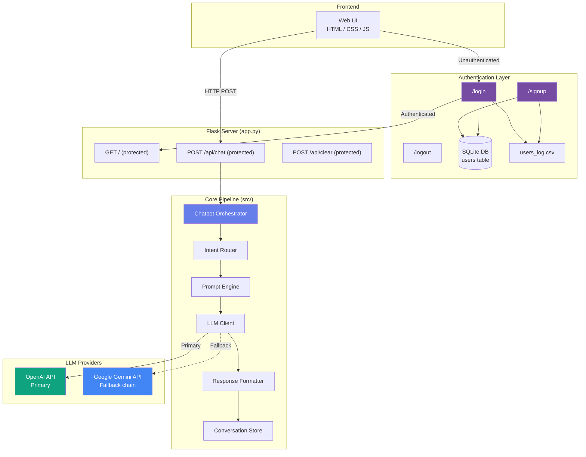
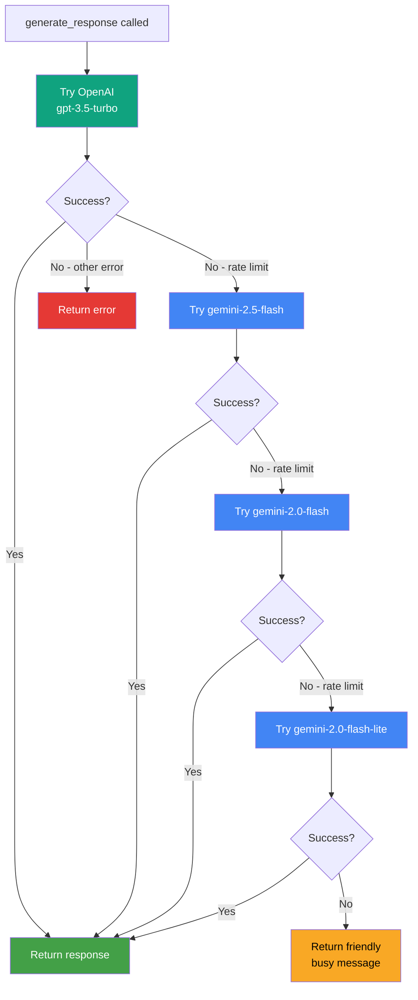
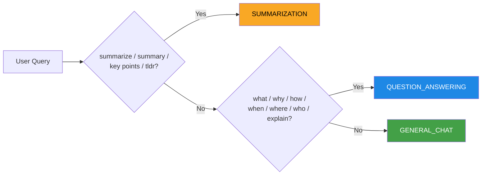
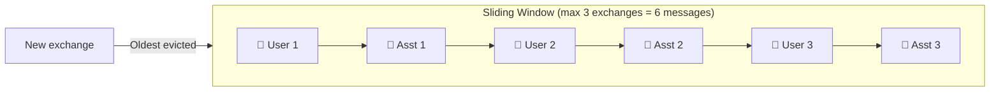

# 🤖 LLM Chatbot

A production-ready conversational AI web application built with Python and Flask. Features **user authentication**, **multi-provider LLM support** (OpenAI primary, Google Gemini fallback), intent-based routing, conversation memory, user access logging, and deployment on Vercel.

**Live demo:** https://llmchatbot-henna.vercel.app

---

## Table of Contents

- [Introduction](#introduction)
- [Architecture Overview](#architecture-overview)
- [Authentication Flow](#authentication-flow)
- [Query Processing Pipeline](#query-processing-pipeline)
- [Provider Fallback Flow](#provider-fallback-flow)
- [Project Structure](#project-structure)
- [Module Reference](#module-reference)
  - [Models](#1-database-models---srcmodelspy)
  - [Auth](#2-authentication---srcauthpy)
  - [User Log](#3-user-access-log---srcuser_logpy)
  - [Configuration](#4-configuration---srcconfigpy)
  - [Intent Router](#5-intent-router---srcrouterpy)
  - [Prompt Engine](#6-prompt-engine---srcpromptspy)
  - [LLM Client](#7-llm-client---srcllm_clientpy)
  - [Response Formatter](#8-response-formatter---srcformatterpy)
  - [Conversation Store](#9-conversation-store---srcconversationpy)
  - [Logger](#10-logger---srcloggerpy)
  - [Chatbot Orchestrator](#11-chatbot-orchestrator---srcchatbotpy)
  - [Flask App](#12-flask-app---apppy)
- [Frontend](#frontend)
- [API Endpoints](#api-endpoints)
- [Setup & Installation](#setup--installation)
- [Configuration Reference](#configuration-reference)
- [Vercel Deployment](#vercel-deployment)
- [Retry & Error Handling](#retry--error-handling)

---

## Introduction

This chatbot application provides a secure, authenticated conversational AI interface that:

- Requires **user registration and login** before accessing the chatbot
- Classifies queries into **Summarization**, **Question Answering**, or **General Chat** intents
- Calls LLM APIs with **automatic provider fallback** (OpenAI → Gemini model chain)
- Formats responses based on detected intent
- Maintains a **sliding-window conversation history** (last 3 exchanges)
- Logs all **user signups and logins** to `users_log.csv`
- Deployed on **Vercel** as a serverless Python application

---

## Architecture Overview



---

## Authentication Flow

```mermaid
flowchart TD
    START([User visits any URL]) --> AUTH{Logged in?}
    AUTH -->|No| REDIR[Redirect to /login]
    AUTH -->|Yes| CHAT[Access chatbot]

    REDIR --> CHOICE{Action}
    CHOICE -->|New user| SIGNUP[/signup]
    CHOICE -->|Existing user| LOGIN[/login]

    SIGNUP --> VAL1{Valid email<br/>+ strong password?}
    VAL1 -->|No| ERR1[Show error]
    ERR1 --> SIGNUP
    VAL1 -->|Yes| DUP{Email already<br/>registered?}
    DUP -->|Yes| ERR2[Duplicate error]
    ERR2 --> SIGNUP
    DUP -->|No| SAVE[Hash password<br/>Save to DB<br/>Log to CSV]
    SAVE --> LOGIN

    LOGIN --> CREDS{Valid<br/>credentials?}
    CREDS -->|No| ERR3[Invalid email/password]
    ERR3 --> LOGIN
    CREDS -->|Yes| SESSION[Create session<br/>Log to CSV]
    SESSION --> CHAT

    style CHAT fill:#43a047,color:#fff
    style ERR1 fill:#e53935,color:#fff
    style ERR2 fill:#e53935,color:#fff
    style ERR3 fill:#e53935,color:#fff
    style SAVE fill:#1e88e5,color:#fff
```

**Password requirements:** min 8 characters, at least one uppercase letter, one number, one special character (`!@#$%...`).

**Security notes:**
- Passwords hashed with bcrypt (auto-salted, never stored plain)
- Same error message for wrong email and wrong password — prevents user enumeration
- Sessions signed with `SECRET_KEY`, persist across browser restarts (`remember=True`)
- All chatbot routes protected with `@login_required`

---

## Query Processing Pipeline

Every user message flows through this pipeline inside [`Chatbot.process_query()`](src/chatbot.py):


| Step | Component | File | What it does |
|------|-----------|------|-------------|
| 1 | Input Validation | [`chatbot.py`](src/chatbot.py) | Rejects empty/whitespace-only queries |
| 2 | Intent Classification | [`router.py`](src/router.py) | Keyword matching → `SUMMARIZATION`, `QUESTION_ANSWERING`, or `GENERAL_CHAT` |
| 3 | Prompt Construction | [`prompts.py`](src/prompts.py) | Builds system prompt + conversation context + current query |
| 4 | LLM API Call | [`llm_client.py`](src/llm_client.py) | Calls primary provider, walks fallback chain on failure |
| 5 | Response Formatting | [`formatter.py`](src/formatter.py) | Intent-specific formatting (bullets, answer/details, etc.) |
| 6 | Conversation Storage | [`conversation.py`](src/conversation.py) | Stores exchange in sliding window (max 3 pairs) |
| 7 | Logging | [`logger.py`](src/logger.py) | Logs query, intent, response, token count, errors |

---

## Provider Fallback Flow

The [`LLMClient`](src/llm_client.py) walks through a model chain on rate-limit errors. Each model has its own independent quota pool.



Rate-limited models are put in a **62-second cooldown** before being retried. Transient 503 errors trigger up to 3 retries with exponential backoff (1s, 2s, 4s).

---

## Project Structure

```
llmchatbot/
├── app.py                    # Flask app — auth + chatbot routes (local)
├── main.py                   # Dev runner with startup banner
├── requirements.txt          # Python dependencies
├── vercel.json               # Vercel deployment config
├── .vercelignore             # Files excluded from Vercel upload
├── .env.example              # Environment variable template
├── users_log.csv             # Auto-generated user access log (local)
│
├── api/
│   └── index.py              # Vercel serverless entry point (mirrors app.py)
│
├── src/
│   ├── models.py             # SQLAlchemy User model
│   ├── auth.py               # Registration, login, validation logic
│   ├── user_log.py           # CSV access log writer
│   ├── config.py             # Config from environment variables
│   ├── chatbot.py            # Main orchestrator
│   ├── router.py             # Intent classification
│   ├── prompts.py            # Prompt construction
│   ├── llm_client.py         # Multi-provider LLM client
│   ├── formatter.py          # Response formatting
│   ├── conversation.py       # Data models & conversation store
│   ├── logger.py             # Structured logging
│   └── __init__.py
│
├── templates/
│   ├── login.html            # Login page
│   ├── signup.html           # Signup page with live password rules
│   └── index.html            # Chatbot UI (auth-protected)
│
├── static/
│   ├── css/
│   │   ├── style.css         # Chatbot UI styles
│   │   └── auth.css          # Login/signup page styles
│   └── js/
│       └── app.js            # Frontend chat logic
│
└── interfaces/
    └── __init__.py
```

---

## Module Reference

### 1. Database Models - [`src/models.py`](src/models.py)

SQLAlchemy model for user accounts. Uses SQLite locally, swappable to PostgreSQL via `DATABASE_URL`.

| Column | Type | Notes |
|--------|------|-------|
| `id` | Integer | Primary key |
| `email` | String(255) | Unique, indexed |
| `password_hash` | String(255) | bcrypt hash |
| `created_at` | DateTime | UTC timestamp |

Inherits `UserMixin` from Flask-Login to provide `is_authenticated`, `is_active`, `get_id()`.

---

### 2. Authentication - [`src/auth.py`](src/auth.py)

All auth logic in one place, completely separate from chatbot code.

| Function | Purpose |
|----------|---------|
| `register_user(email, password)` | Validates, hashes password, saves to DB |
| `authenticate_user(email, password)` | Verifies credentials, returns User or error |
| `validate_email(email)` | Regex format check |
| `validate_password(password)` | Enforces strength rules |
| `load_user(user_id)` | Flask-Login session loader |

---

### 3. User Access Log - [`src/user_log.py`](src/user_log.py)

Appends every signup and login to `users_log.csv`:

```
event,email,timestamp
signup,alice@example.com,2026-04-14 17:45:00 UTC
login,alice@example.com,2026-04-14 17:46:12 UTC
```

Writes to project root locally; falls back to `/tmp/users_log.csv` on Vercel (read-only filesystem).

---

### 4. Configuration - [`src/config.py`](src/config.py)

Loads and validates all settings from environment variables via `python-dotenv`.

| Field | Default | Source |
|-------|---------|--------|
| `provider` | `"openai"` | `LLM_PROVIDER` |
| `openai_api_key` | `""` | `OPENAI_API_KEY` |
| `gemini_api_key` | `""` | `GEMINI_API_KEY` |
| `model` | `"gpt-3.5-turbo"` | `LLM_MODEL` |
| `temperature` | `0.7` | `LLM_TEMPERATURE` |
| `timeout` | `30` | `LLM_TIMEOUT` |
| `log_level` | `"INFO"` | `LOG_LEVEL` |

---

### 5. Intent Router - [`src/router.py`](src/router.py)

Classifies user queries using keyword matching.



---

### 6. Prompt Engine - [`src/prompts.py`](src/prompts.py)

Builds structured prompts in OpenAI Chat Completion format with an intent-specific system prompt and the last 3 conversation exchanges as context.

---

### 7. LLM Client - [`src/llm_client.py`](src/llm_client.py)

| Class | Provider | Method |
|-------|----------|--------|
| `OpenAIClient` | OpenAI | `openai` SDK |
| `GeminiClient` | Google Gemini | Direct REST API (no heavy SDK) |
| `LLMClient` | Unified | Primary + fallback chain |

`GeminiClient` walks through `GEMINI_MODEL_CHAIN = [gemini-2.5-flash, gemini-2.0-flash, gemini-2.0-flash-lite]` automatically on rate limits, with per-model cooldown tracking.

---

### 8. Response Formatter - [`src/formatter.py`](src/formatter.py)

| Intent | Formatting applied |
|--------|-------------------|
| Summarization | Normalizes bullets (`*/-/+` → `•`), adds header spacing |
| Question Answering | Splits into `**Answer:**` + `**Details:**` sections |
| General Chat | Normalizes whitespace, preserves paragraphs |

---

### 9. Conversation Store - [`src/conversation.py`](src/conversation.py)

Sliding window of the last 3 exchanges (6 messages). FIFO eviction when exceeded.



---

### 10. Logger - [`src/logger.py`](src/logger.py)

| Handler | Level | Output |
|---------|-------|--------|
| Console | DEBUG+ | stdout |
| File | INFO+ | `logs/chatbot.log` (skipped on read-only filesystems) |

---

### 11. Chatbot Orchestrator - [`src/chatbot.py`](src/chatbot.py)

Wires all components together. `process_query()` runs the full pipeline and catches all exceptions, returning a user-friendly message on failure.

---

### 12. Flask App - [`app.py`](app.py)

Full route table:

| Method | Path | Auth | Purpose |
|--------|------|------|---------|
| `GET` | `/login` | Public | Login page |
| `POST` | `/login` | Public | Process login |
| `GET` | `/signup` | Public | Signup page |
| `POST` | `/signup` | Public | Create account |
| `GET` | `/logout` | Required | Log out |
| `GET` | `/` | Required | Chatbot UI |
| `POST` | `/api/chat` | Required | Send message |
| `POST` | `/api/clear` | Required | Clear history |

---

## Frontend

| File | Purpose |
|------|---------|
| [`templates/login.html`](templates/login.html) | Login form with show/hide password toggle |
| [`templates/signup.html`](templates/signup.html) | Signup form with live password strength indicator |
| [`templates/index.html`](templates/index.html) | Chat UI — shows logged-in email + logout button |
| [`static/css/auth.css`](static/css/auth.css) | Auth pages styling (purple gradient, matching theme) |
| [`static/css/style.css`](static/css/style.css) | Chatbot UI styling |
| [`static/js/app.js`](static/js/app.js) | Async message sending, loading dots, history clearing |

---

## API Endpoints

All chatbot endpoints require an active session (redirect to `/login` if not authenticated).

| Method | Path | Body | Response |
|--------|------|------|----------|
| `POST` | `/api/chat` | `{ "message": "..." }` | `{ "success": true, "response": "..." }` |
| `POST` | `/api/clear` | — | `{ "success": true, "message": "..." }` |

Error responses: HTTP 400 (empty message) or 500 (server error) with `{ "success": false, "error": "..." }`.

---

## Setup & Installation

### 1. Clone the repository

```bash
git clone https://github.com/EHTESHAM1231/chatbot.git
cd chatbot
```

### 2. Create a virtual environment

```bash
python -m venv venv
# Windows
venv\Scripts\activate
# macOS/Linux
source venv/bin/activate
```

### 3. Install dependencies

```bash
pip install -r requirements.txt
```

### 4. Configure environment

```bash
cp .env.example .env
```

Edit `.env`:

```env
LLM_PROVIDER=openai
OPENAI_API_KEY=your_openai_api_key_here
GEMINI_API_KEY=your_gemini_api_key_here   # optional fallback
LLM_MODEL=gpt-3.5-turbo
SECRET_KEY=generate-with-python-secrets-token-hex-32
DATABASE_URL=sqlite:///chatbot_users.db
```

Generate a secret key:
```bash
python -c "import secrets; print(secrets.token_hex(32))"
```

### 5. Run the application

```bash
python app.py
```

Open **http://localhost:3000** — you'll land on the login page. Sign up first, then log in to access the chatbot.

---

## Configuration Reference

| Variable | Required | Default | Description |
|----------|----------|---------|-------------|
| `LLM_PROVIDER` | No | `openai` | Primary provider (`openai` or `gemini`) |
| `OPENAI_API_KEY` | Yes* | — | OpenAI API key ([get one](https://platform.openai.com/api-keys)) |
| `GEMINI_API_KEY` | Yes* | — | Google Gemini API key ([get one](https://aistudio.google.com/app/apikey)) |
| `LLM_MODEL` | No | `gpt-3.5-turbo` | Model identifier |
| `LLM_TEMPERATURE` | No | `0.7` | Sampling temperature (0.0–2.0) |
| `LLM_TIMEOUT` | No | `30` | Request timeout in seconds |
| `LOG_LEVEL` | No | `INFO` | Logging level |
| `SECRET_KEY` | Yes | — | Flask session signing key (use a long random string) |
| `DATABASE_URL` | No | `sqlite:///chatbot_users.db` | Database URI (SQLite or PostgreSQL) |

*At least one API key required.

---

## Vercel Deployment

The app is deployed at **https://llmchatbot-henna.vercel.app** via `api/index.py` as a serverless Python function.

### Deploy your own

```bash
npm install -g vercel
vercel login
vercel --prod --yes
```

Set environment variables on Vercel:
```bash
# Use cmd redirection to avoid newline issues on Windows PowerShell
$val = "your_value"; [System.IO.File]::WriteAllText("$env:TEMP\val.txt", $val)
cmd /c "vercel env add VARIABLE_NAME production < $env:TEMP\val.txt"
```

Required Vercel env vars: `OPENAI_API_KEY`, `GEMINI_API_KEY`, `SECRET_KEY`, `LLM_PROVIDER`, `LLM_MODEL`.

**Note:** SQLite on Vercel uses `/tmp` (ephemeral per instance). For persistent user storage across deployments, set `DATABASE_URL` to a PostgreSQL connection string (e.g. [Neon](https://neon.tech), [Supabase](https://supabase.com)).

---

## Retry & Error Handling

| Scenario | Behavior |
|----------|----------|
| OpenAI rate limit | Falls back to Gemini model chain |
| Gemini 429 (rate limit) | Puts model in 62s cooldown, tries next model in chain |
| Gemini 503 (transient) | Retries same model up to 3× with exponential backoff |
| All models exhausted | Returns "The AI service is currently busy. Please try again." |
| Auth failure | Returns "Invalid email or password." (same for both — no enumeration) |
| Duplicate registration | Returns "An account with this email already exists." |
| Weak password | Returns specific rule violation message |
| Empty chat message | Returns HTTP 400 |
| Unexpected exception | Caught at orchestrator level, returns generic error |
